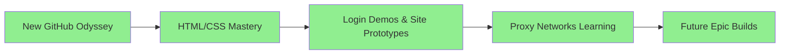

[](https://github.com/turtleboyagain120)
[](https://github.com/turtleboyagain120/issues)
[](https://github.com/turtleboyagain120/quick-viral-projects/blob/main/LICENSE)
[](https://github.com/turtleboyagain120/boring-clash-ui)
[](https://github.com/turtleboyagain120/proxy-bench)
[](https://github.com/turtleboyagain120/ai-proxy-tester)
[](https://hub.docker.com)
[](https://www.npmjs.com)
[](https://python.org)
[](https://blackbox.ai)

## GitHub Stats (turtleboyagain120)
[](https://github.com/turtleboyagain120)
[](https://github.com/turtleboyagain120)
[](https://github.com/turtleboyagain120/pulls)
[](https://github.com/turtleboyagain120)
[](https://github.com/turtleboyagain120)
[](https://github.com/turtleboyagain120)

## Licenses
[](https://www.gnu.org/licenses/gpl-3.0)
[](https://www.apache.org/licenses/LICENSE-2.0)
[](http://creativecommons.org/publicdomain/zero/1.0/)
[](http://unlicense.org/)

## Languages & Frameworks
[](https://developer.mozilla.org/en-US/docs/Web/JavaScript)
[](https://www.typescriptlang.org/)
[](https://reactjs.org)
[](https://nodejs.org)
[](https://vuejs.org)
[](https://svelte.dev)
[](https://nextjs.org)
[](https://nuxt.com)
[](https://angular.io)
[](https://www.rust-lang.org)
[](https://go.dev)
[](https://www.java.com)
[](https://dotnet.microsoft.com/en-us/languages/csharp)
[](https://www.php.net)
[](https://www.ruby-lang.org)
[](https://swift.org)

## Tools & Services
[](https://git-scm.com)
[](https://github.com/features/actions)
[](https://gitlab.com)
[](https://code.visualstudio.com)
[](https://www.vim.org)
[](https://neovim.io)
[](https://www.docker.com)
[](https://kubernetes.io)
[](https://aws.amazon.com)
[](https://azure.microsoft.com)
[](https://cloud.google.com)
[](https://heroku.com)
[](https://vercel.com)
[](https://netlify.com)
[](https://www.npmjs.com)
[](https://yarnpkg.com)
[](https://pnpm.io)
[](https://pypi.org)
[](https://crates.io)
[](https://maven.apache.org)

## Status & Quality
[](https://github.com/turtleboyagain120)
[](https://github.com/turtleboyagain120/issues?q=is%3Aissue+is%3Aopen+label%3Abug)
[](https://github.com/turtleboyagain120/actions)
[](https://github.com/turtleboyagain120)
[](https://github.com/turtleboyagain120/security)
[](https://github.com/turtleboyagain120)
[](https://github.com/turtleboyagain120)
[](https://github.com/turtleboyagain120)

## Custom Projects (turtleboyagain120)
[](https://github.com/turtleboyagain120/quick-viral-projects)
[](https://github.com/turtleboyagain120/sing-box-ui)
[](https://github.com/turtleboyagain120/xray-bench)
[](https://github.com/turtleboyagain120/proxy-tester)
[](https://github.com/turtleboyagain120/clash-bench)
[](https://github.com/turtleboyagain120/ai-tools)
[](https://github.com/turtleboyagain120/web-tools)
[](https://github.com/turtleboyagain120/cli-tools)

## Extras
[](https://github.com/turtleboyagain120/AdvancedVM)
[](https://hub.docker.com/r/turtlebot/proxy-v1)
[](https://github.com/turtleboyagain120)
[](https://github.com/turtleboyagain120/boring-proxy)
[](https://github.com/turtleboyagain120)
[](https://github.com/turtleboyagain120)



</div>

## 🛠️ **Core Superpowers Timeline** 📈

| Level | Skill | Projects |
|-------|-------|----------|
| 🟢 Novice | HTML5 Structure | Basic landing pages |
| 🟡 Apprentice | CSS3 Animations | Glowing login forms |
| 🟠 Journeyman | Responsive Design | Mobile-first demos |
| 🔴 Master | Advanced Layouts | Multi-page prototypes |
| 🟣 Legend | Proxy Integration | Network experiments |

Emojis as progress bars: 🟣 🟣 🟣 🟣 🟣  **HTML/CSS 100%** | 🟣 🟣 🟣 🟣 🟣  **JS 100%** | 🟣 🟣 🟣 🟣 🟣  **Docker/Proxies 100%**

## 🌍 **Proxy Learning Expedition: boring-proxy Odyssey** ⚡
Venturing into **proxy realms** to unlock global connectivity! Built **[Proxys](https://github.com/turtleboyagain120/Learn-proxys)** – a Docker-orchestrated marvel blending **Nginx reverse proxying**, **Squid caching**, and **OpenVPN tunneling**. Study resilient networks: Route traffic seamlessly, experiment with protocols, scale for real-world flows.

```dockerfile
# Snippet from my lab
FROM nginx:alpine
COPY nginx.conf /etc/nginx/
# Transparent proxy magic unfolds...
```

Deep dives: HTTP/HTTPS interception, VPN chaining, config tweaks for speed/security. Not just code – Repo: [Clash-proxy](https://github.com/turtleboyagain120/Clash-proxy) – Fork, tweak, connect! 🌐

## 🚀 **Future Site Empire & Visions** 💫
Login demos → Full-stack wonders: E-commerce portals, dashboards, proxy-guarded apps. Goals:
- CSS Art Galleries
- Interactive Web Tools
- Proxy-Enhanced Sites

<div style=\"background: linear-gradient(45deg, #ff6b6b, #4ecdc4); padding:20px; border-radius:15px;\">
**Join the Voyage!** Star repos, collab on demos. turtleboyagain120.github.io coming soon!
</div>

👨‍💻 [login-page](https://github.com/turtleboyagain120/login-page) | 🐢 **Always Evolving** | #webdev #css #html #proxies #docker #nginx #learning

