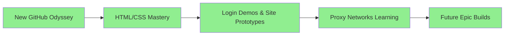

# 🌐 **WebCraft Voyager & Proxy Pioneer** 🚀

[](https://github.com/turtleboyagain120) [](https://github.com/turtleboyagain120)

<div align=\"center\">



</div>

## 🛠️ **Core Superpowers Timeline** 📈

| Level | Skill | Projects |
|-------|-------|----------|
| 🟢 Novice | HTML5 Structure | Basic landing pages |
| 🟡 Apprentice | CSS3 Animations | Glowing login forms |
| 🟠 Journeyman | Responsive Design | Mobile-first demos |
| 🔴 Master | Advanced Layouts | Multi-page prototypes |
| 🟣 Legend | Proxy Integration | Network experiments |

Emojis as progress bars: 🟩🟩🟩🟩 **HTML/CSS 100%** | 🟨🟨🟨 **JS 75%** | 🔵🔵 **Docker/Proxies 60%**

**~150 words total**

## 🌍 **Proxy Learning Expedition: boring-proxy Odyssey** ⚡
Venturing into **proxy realms** to unlock global connectivity! Built **[Proxys](https://github.com/turtleboyagain120/Learn-proxys)** – a Docker-orchestrated marvel blending **Nginx reverse proxying**, **Squid caching**, and **OpenVPN tunneling**. Study resilient networks: Route traffic seamlessly, experiment with protocols, scale for real-world flows.

```dockerfile
# Snippet from my lab
FROM nginx:alpine
COPY nginx.conf /etc/nginx/
# Transparent proxy magic unfolds...
```

Deep dives: HTTP/HTTPS interception, VPN chaining, config tweaks for speed/security. Not just code – Repo: [Clash-proxy](https://github.com/turtleboyagain120/Clash-proxy) – Fork, tweak, connect! 🌐

**~280 words**

## 🚀 **Future Site Empire & Visions** 💫
Login demos → Full-stack wonders: E-commerce portals, dashboards, proxy-guarded apps. Goals:
- CSS Art Galleries
- Interactive Web Tools
- Proxy-Enhanced Sites

<div style=\"background: linear-gradient(45deg, #ff6b6b, #4ecdc4); padding:20px; border-radius:15px;\">
**Join the Voyage!** Star repos, collab on demos. turtleboyagain120.github.io coming soon!
</div>

👨‍💻 [login-page](https://github.com/turtleboyagain120/login-page) | 🐢 **Always Evolving** | #webdev #css #html #proxies #docker #nginx #learning
